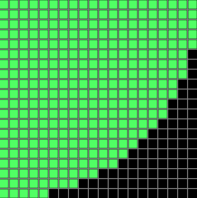

# pi_approximator

This is by no means a program i expect anyone to be using, it's just here in case you find it interesting.

Inspired by The Coding Train's video on approximating pi with a circle and a square(https://youtu.be/5cNnf_7e92Q).
I decided to, instead of generating random dots and relying on the distribution to be perfectly uniform, to simply count how many possible positions within the circle there are.
That way it's like a uniform distribution of random numbers, but without the random numbers part.
Initially I would just go through each integer coordinate and increment a counter for every coordinate that is less than a certain distance from the center.
That was a lie, i didn't actually calculate the distance from the center, but the distance from (0,0), so something like the "upper left corner".
That saved some unnecessary subtractions.
Fortunately the ratio of the area of a quarter circle to a quarter square is still the same.
This was fine for small "squares" but was obviously an O(n^2) algorithm.

Further optimisations to the algorithm:

The algorithm has a nested for loop. It first goes through a whole horizontal line before going a step down.
This allowed for breaking early; once the x-loop crosses the circle's boundary, only the 'cells' to the left of that are within the circle.
x is added to the circle_counter, and the loop breaks early.

This was better but still far from optimal.
We basically did a linear search for the boundary of the circle.
But we can do a binary search instead!
By moving half to the right when inside the circle, and half to the left when outside of it, we can cut down the final complexity of this algorithm to O(n*log(n))

The final step was using rayon to quickly parallelise this.
Surely this can be further optimised, but I'm happy with it as is.

The program doesn't include any visualisation, so here you go:
